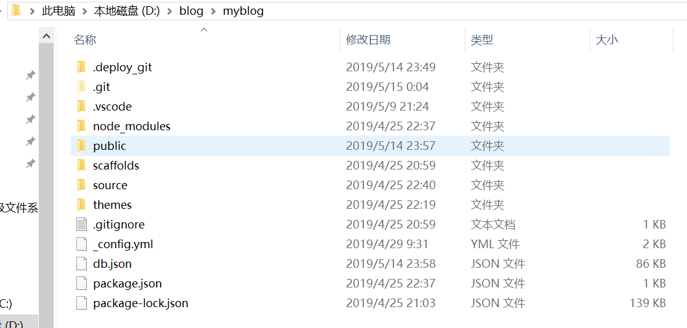
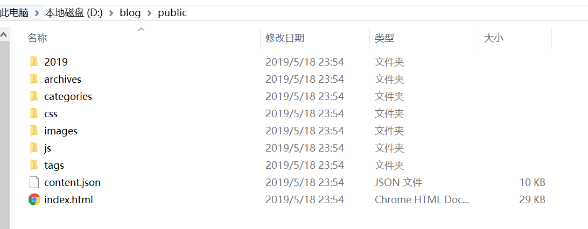

## 前言
使用Github pages服务进行搭建和部署博客的好处有：
<!--more-->
> 1.全是静态文件，访问速度快
> 2.免费方便，可以搭建一个自由的个人博客
> 3.可以随意的绑定自己的域名
> 4.数据安全可靠，基于Github的版本管理，可以随时恢复到历史版本
> 5.博客可以轻松打包、转移、发布到其它平台


### 准备工作
在一切开始之前，你必须已经：

> - 有一个github账号
> - 安装了node.js,npm，并了解其相关知识
> - 安装了git for windows

## 搭建github博客
### 创建仓库
新建一个名称为 你的用户名.github.io的仓库，必须是你的用户名，其他名称无效，将来你的网站的访问地址就是https://你的用户名.github.io。
由此可见，每个github用户最多只能创建一个这样可以使用域名访问的网站。

### 绑定域名
当然不绑定域名的话也是可以的，可直接使用github提供的域名进行访问。


## 使用hexo写博客

### hexo简介
Hexo是一个简单、快速、强大的基于 Github Pages 的博客发布工具，支持Markdown格式，有众多优秀插件和主题。
地址：[hexo官网](http://hexo.io)


### 原理
由于github pages存放的都是静态文件，博客存放的不只是文章内容，还有文章列表、分类、标签、翻页等动态内容，假如每次写完一篇文章都要手动更新博文目录和相关链接信息，相信谁都会疯掉，所以hexo所做的就是将这些md文件都放在本地，每次写完文章后调用写好的命令来批量完成相关页面的生成，然后再将有改动的页面提交到github。

> 注意事项:
> 很多命令既可以用Windows的cmd来完成，也可以使用git bash来完成，但是部分命令会有一些问题，为避免不必要的问题，建议全部使用git bash来执行

### 准备工作
需要通过npm包资源管理器来下载Hexo博客框架，但由于网络限制，下载速度会非常慢，所以可以通过安装Cnpm来提高下载速度
`$ npm install cnpm --registry=https://registry.npm.taobao.org`

### 安装

通过以下指令安装hexo框架：
`$ cnpm install -g hexo-cli`

### 初始化
在电脑的某个地方创建一个用来存放博客代码的地方，并在此文件夹中进行初始化：
`$ hexo init`
hexo会自动下载一些文件到这个目录并建立Hexo框架，我的目录结构如下:

`$ hexo g #生成`
`$ hexo s #启动服务`
执行上述命令后，hexo会在public文件夹中自动生成相应的HTML文件：

hexo s开启本地预览服务，打开浏览器访问 http://localhost:4000 即可看到内容，第一次初始化时hexo已经帮我们初始化了主题。

### 修改主题
由于默认的主题比较丑，hexo可以非常方便的为我们提供主题替换，个人博客使用的主题是：[hexo-theme-icarus](https://github.com/ppoffice/hexo-theme-icarus)

首先下载这个主题
`git clone https://github.com/ppoffice/hexo-theme-icarus.git themes/icarus`
修改_config.yml中的theme: landscape改为theme: icarus,然后重新执行`hexo g`来生成静态文件。
如果出现了一些莫名其妙的错误，可以先执行`hexo clean`来清理一些public文件夹中文件并重新生成部署。

### 上传到Github
首先先安装插件
`$ npm install hexo-deployer-git --save`
然后再配置_config.yml中deploy内容：
```yaml
deploy:
  type: git
  repo: https://github.com/BuRNIngsuperman/BuRNIngsuperman.github.io.git
  branch: master
```
注意各个属性自己更改相应的值。
然后打开终端，执行`hexo d`来将代码提交。这时候我们打开网站的访问地址就是http://你的用户名.github.io ，就可以看到blog已经部署完成。

### hexo博客通过管理和迁移
由于hexo框架博客自带的上传到github上只有生成的public文件中的静态文件，因此在迁移到另外一台电脑时需要在Github上备份环境文件，这里可以借鉴一下[hexo博客同步管理](https://www.jianshu.com/p/fceaf373d797),实现多台电脑同步管理。


## 常用的hexo指令

常见指令：
```
hexo new "postName" #新建文章
hexo new page "pageName" #新建页面
hexo generate #生成静态页面至public目录
hexo server #开启预览访问端口（默认端口4000，'ctrl + c'关闭server）
hexo deploy #部署到GitHub
hexo help  # 查看帮助
hexo version  #查看Hexo的版本
```

